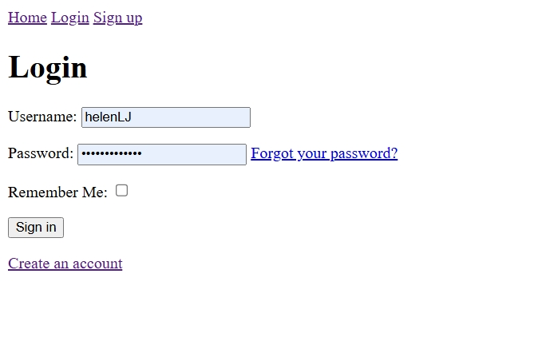
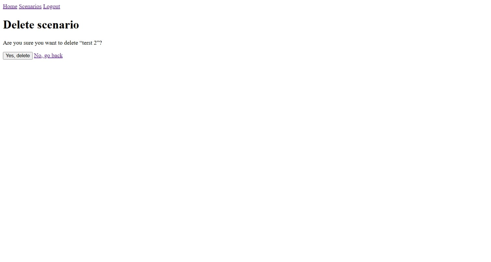
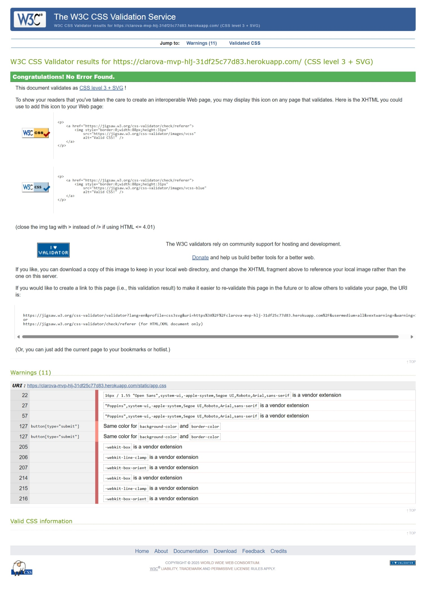

# Clarova Crisis Comms & AI Training Platform (MVP)
**Live site:** https://clarova-mvp-hlj-31df25c77d83.herokuapp.com  
**Repository:** https://github.com/HelenLloydJeng/clarova-mvp

## Overview
Clarova is a Django-based SaaS platform that helps public sector and charity communications teams respond quickly and responsibly in a crisis, and provides embedded AI governance training. The MVP is designed to meet the Code Institute Full Stack assessment criteria.

## Project Goals
- Enable teams to prepare crisis scenarios, manage them through status updates, and track progress clearly.  
- Provide authenticated access and governance-aware training modules.  
- Use Stripe (test mode) to unlock premium training content.  
  
## User Experience (UX)
Documented using the 5 planes: Strategy, Scope, Structure, Skeleton, and Surface.

### 1. Strategy (User and Business Goals)

**Target users:** public sector and charity comms teams; approvers; executives; learners.  
**Business goals:** recurring subscription income, trusted training resource, governance-ready workflows.

### 2. Scope (User Stories)

#### Implemented in the MVP
- As a new user, I want to **register and log in** so I can access the platform securely.  
- As a user, I want to **create, view, edit and delete crisis scenarios** (full CRUD).  
- As a user, I want to **update a scenario’s status** (e.g. Draft / For Review / Approved) so progress is clear.  
- As a user, I want the **Scenarios area to be scoped to my account** so I only see my own scenarios.  
- As a user, I want protected pages (e.g. Scenarios, Training) to **redirect me to login** if I’m not authenticated.  
- As a user, I want to access a **free training module** to evaluate the platform before upgrading.  
- As a user, I want to **buy premium training modules via Stripe Checkout (test mode)** and, on success, gain access (entitlement).  
- As a user, I want module pages to indicate when a module is **Owned** after purchase.

#### Future development
- Templates: author/edit reusable templates and apply them to scenarios.  
- Approvals: routed approver assignments, decision capture, and **audit trail** beyond simple status flags.  
- Training quizzes with stored results and completion badges.  
- Duplicate an existing scenario to save time.  
- Approval history and exportable audit logs.  
- Subscription self-service (update payment method, invoices) and Stripe webhooks for server-side confirmation.  
- Team notifications and activity feed.  
- AI-assisted drafting and performance analytics.

### 3. Structure (Information Architecture)
- Global navigation: **Home**, **Scenarios**, **Training**, **Account**.  
- **Scenarios:** list (user-scoped), create, detail, edit, delete, and status update.  
- **Training:** module list (free + paid), module detail with preview lesson, Stripe Checkout for paid items, **entitlements gating** after success.  
- **Authentication:** login, signup, logout (django-allauth).

### 4. Skeleton (Wireframes – Text Based)

**Home**
- Logo + nav (Home, Dashboard, Scenarios, Training, Login/Logout)
- Hero section with headline, subheading, and two CTA buttons: *Start Learning* / *Try Scenarios*
- Footer with links and copyright

**Dashboard**
- Welcome message with username
- Quick action buttons: *Create Scenario* / *Explore Training*
- Status boxes: number of scenarios, number of owned modules

**Scenarios**
- List: table of user’s scenarios with title, date, and actions (View, Edit, Delete)
- Detail: scenario title + description with Edit/Delete/Back buttons
- Form: title and description fields, Save/Cancel buttons

**Training**
- List: cards for each module
  - Example Module 1: preview + buy option
  - Example Module 2: marked (Owned) with full lesson access
- Detail: description with preview if not purchased, or full lessons if owned
- Success page: “Payment successful. Module unlocked.”
- Cancel page: “Payment cancelled. Try again later.”

**Auth**
- Login: email/username + password form
- Sign Up: username, email, password, confirm password
- Logout: confirmation with *Logout* / *Back to Home*

**Error Pages**
- 403 Forbidden: “You don’t have permission.” + Home link
- 404 Not Found: “Page not found.” + Home link
- 500 Server Error: “Something went wrong.” + Home link

## Data Model Overview

### Accounts
- **Organisation**
  - `id`, `name`, `owner` (FK to User), `created_at`
- **UserProfile**
  - `id`, `user` (OneToOne to User), `organisation` (FK, optional), `role`, `created_at`

### Scenarios
- **Scenario**
  - `id`, `user` (FK to User), `title` (unique per user), `description`, `status` (Draft/Review/Approved), timestamps

### Training
- **Module**
  - `id`, `title`, `description`, `price_cents`, `is_free`
- **Lesson**
  - `id`, `module` (FK), `title`, `content`, `is_preview`, `order`
- **Entitlement**
  - `id`, `user` (FK), `module` (FK), `created_at`  
  - Unique constraint on (user, module)

**Relationships**
- One user → many scenarios  
- One module → many lessons  
- Users and modules connected through entitlements

## Code Structure & Logic

### Project layout (high level)
clarova/
├─ clarova/                # project settings and root URLConf
├─ core/                   # home + dashboard
├─ accounts/               # Organisation, UserProfile, signals, /team/org
├─ scenarios/              # CRUD for Scenario (user-scoped)
├─ training/               # Module, Lesson, Entitlement, Stripe flow
├─ templates/              # project-level templates (base, core, account, scenarios, training)
├─ static/                 # app.css, images
└─ requirements.txt

### Installed apps (key)
- django.contrib.* (auth, admin, sessions, messages, staticfiles)
- allauth, allauth.account
- core, accounts, scenarios, training

### Settings highlights
- `TEMPLATES['DIRS'] = [BASE_DIR / 'templates']`, `APP_DIRS = True`
- Auth backends include `allauth.account.auth_backends.AuthenticationBackend`
- Middleware includes `allauth.account.middleware.AccountMiddleware`
- Production: `DEBUG=False`, WhiteNoise for static files, `ALLOWED_HOSTS`, `CSRF_TRUSTED_ORIGINS`
- Secrets handled via environment variables (`.env` locally, Heroku Config Vars in production)
- Stripe keys: `STRIPE_SECRET_KEY`, `STRIPE_PUBLISHABLE_KEY`

### URL routing (summary)
- Project `clarova/urls.py`
  - `""` → `core:home`
  - `"dashboard/"` → `core:dashboard`
  - `"accounts/"` → allauth URLs (login, signup, logout)
  - `"team/org"` → accounts org create view
  - `"scenarios/"` → scenarios URLs (list, create, detail, edit, delete)
  - `"training/"` → training URLs (list, detail, buy, success, cancel)
- Custom error handlers for 403, 404, 500

### Templates
- `base.html` provides global shell, nav, skip link, and messages area
- Other templates extend `base.html`
- Static assets referenced with ``

### Accounts app
- **Models:** `Organisation`, `UserProfile` (OneToOne to `User`)
- **Signals:** auto-create `UserProfile` on user registration
- **View:** `/team/org` allows logged-in users to create their Organisation (duplicate-protected)
- **Auth:** allauth handles signup, login, logout; protected views use `LoginRequiredMixin`

### Scenarios app
- **Model:** `Scenario(user, title, description, status, timestamps)`
- **Views:** class-based with `LoginRequiredMixin`
  - Querysets filtered by `request.user`
- **Form validation:** unique title enforced per user
- **Status choices:** Draft, For Review, Approved
- **UX:** success/error messages displayed via Django messages framework

### Training app
- **Models:** `Module`, `Lesson`, `Entitlement`
- **Access control:** preview lesson always visible; full content requires an Entitlement
- **Stripe flow (test mode):**
  - Buy button creates a Checkout Session
  - Success page verifies payment and grants an Entitlement
  - Cancel page leaves module in preview state
- **UI states:** Owned modules display “Owned” and unlocked lessons
---
## Technologies
- **Languages & framework:** Python 3, Django 3.2, HTML5, CSS3  
- **Database:** PostgreSQL (local + Heroku Postgres in production)  
- **Payments:** Stripe Checkout (test mode)  
- **Version control & hosting:** Git, GitHub, Heroku  
- **Front-end:** custom CSS with basic Bootstrap for layout components  

## Libraries and APIs
- **django-allauth** – authentication (signup, login, logout)  
- **dj-database-url** – database configuration for Heroku  
- **whitenoise** – static files in production  
- **gunicorn** – WSGI HTTP server for Heroku deployment  
- **stripe** – Python SDK for Stripe Checkout integration  
- **python-dotenv** – environment variable management in development  

## Security
- Secrets stored in environment variables (never committed to repo)  
- `DEBUG=False` in production with secure cookies and SSL enforced  
- CSRF protection and authentication-based access control for protected routes
- Custom error pages for 403, 404, 500 prevent sensitive information leaks  

## Deployment

### Local development
1. Clone the repository:
   git clone https://github.com/HelenLloydJeng/clarova-mvp.git
   cd clarova-mvp

2. Create and activate a virtual environment:
   python -m venv .venv
   source .venv/bin/activate    # Mac/Linux
   .venv\Scripts\activate       # Windows

3. Install dependencies:
   pip install -r requirements.txt

4. Create a `.env` file in the project root and add environment variables:
   SECRET_KEY=your_django_secret_key
   DEBUG=True
   STRIPE_SECRET_KEY=sk_test_...
   STRIPE_PUBLISHABLE_KEY=pk_test_...

5. Apply migrations and create a superuser:
   python manage.py migrate
   python manage.py createsuperuser

6. Run the development server:
   python manage.py runserver

   The site is available at http://127.0.0.1:8000

### Deployment to Heroku
1. Create a Heroku app and provision a Postgres database:
   heroku create clarova-mvp-hlj
   heroku addons:create heroku-postgresql:hobby-dev

2. Set config vars in Heroku:
   heroku config:set SECRET_KEY=your_django_secret_key
   heroku config:set STRIPE_SECRET_KEY=sk_test_...
   heroku config:set STRIPE_PUBLISHABLE_KEY=pk_test_...
   heroku config:set DISABLE_COLLECTSTATIC=0

3. Push the code to Heroku:
   git push heroku main

4. Run migrations on Heroku:
   heroku run python manage.py migrate

5. (Optional) Create a superuser on Heroku:
   heroku run python manage.py createsuperuser

6. The live app is available at:
   https://clarova-mvp-hlj-31df25c77d83.herokuapp.com

### Static files
- WhiteNoise is configured to serve static files in production.
- Static files are collected automatically during deployment with collectstatic.

### Version control & deployment
- Git and GitHub used for source control.
- Heroku deployment via git push heroku main.
- Frequent, atomic commits with meaningful messages.

## How to Fork/Clone & Run Locally
**Fork**
1. On GitHub, click **Fork** on the repository page.
2. Clone your fork:
   - `git clone https://github.com/<your-username>/clarova-mvp.git`
   - `cd clarova-mvp`

**Clone (without forking)**
1. `git clone https://github.com/HelenLloydJeng/clarova-mvp.git`
2. `cd clarova-mvp`

**Environment**
1. Create virtualenv and install deps:
   - `python -m venv .venv`
   - `source .venv/bin/activate` (Mac/Linux) or `.venv\Scripts\activate` (Windows)
   - `pip install -r requirements.txt`
2. Create `.env`:

## Troubleshooting & Fixes (Key Issues Resolved)

### Authentication / Routing
- **ImproperlyConfigured:** `allauth.account.middleware.AccountMiddleware` missing  
  **Fix:** Added `'allauth.account.middleware.AccountMiddleware'` after `'django.contrib.auth.middleware.AuthenticationMiddleware'` in `MIDDLEWARE`.

- **Wrong accounts path:** App showed `/accountslogin/`  
  **Cause:** Missing slash in URL include.  
  **Fix:** `path('accounts/', include('allauth.urls'))` and updated nav links to ``, ``, ``.

- **NoReverseMatch (`core:dashboard`):** Home 500 error  
  **Cause:** Missing URL name.  
  **Fix:** Added `path('dashboard/', views.dashboard, name='dashboard')` and corresponding view.

- **Training 404:** `/training/` not found  
  **Cause:** App URLs not included at project level.  
  **Fix:** `path('training/', include('training.urls'))` and `app_name = 'training'` in training URLs.

- **NoReverseMatch (`training:buy`):** Module detail page  
  **Cause:** Missing/misnamed route.  
  **Fix:** Added `path('buy/<int:pk>/', views.checkout_create, name='buy')` and used ``.

- **TemplateSyntaxError:** “Invalid block tag 'else'”  
  **Cause:** Used `` where `` or an `endblock` was required.  
  **Fix:** Replaced with `` and removed stray tag.

### Static files / Production
- **Admin 500 after `DEBUG=False`:** “No directory at: /app/staticfiles/”  
  **Cause:** Static files not collected/served.  
  **Fix:** Ensured WhiteNoise in settings, ran `collectstatic`, and verified `ALLOWED_HOSTS` and `CSRF_TRUSTED_ORIGINS`.

- **Static assets 404:** `/static/app.css`, `/static/favicon.ico`  
  **Cause:** Files referenced but missing.  
  **Fix:** Added `static/app.css` and `static/favicon.ico`; redeployed.

- **Static not collected on build:**  
  **Cause:** `DISABLE_COLLECTSTATIC` was set.  
  **Fix:** `heroku config:unset DISABLE_COLLECTSTATIC -a clarova-mvp-hlj` and redeploy.

### Heroku / Release
- **Release failed:** `Nonexistent flag: --noinput`  
  **Cause:** Flag placed in Procfile `release:` step.  
  **Fix:** Removed from Procfile; keep `--noinput` only for `manage.py collectstatic`.

- **Deploy not updating:**  
  **Cause:** Mixed remotes/auto-deploy cache.  
  **Fix:** Verified remotes and pushed directly with `git push heroku main`; confirmed new slug build.

- **Heroku CLI config error:** “invalid. Must be in the format FOO=bar.”  
  **Cause:** Missing `-a` app flag when setting vars.  
  **Fix:** `heroku config:set STRIPE_SECRET_KEY=... -a clarova-mvp-hlj` (and same for publishable key).

  - **IndentationError in `scenarios/models.py`**  
  *Cause:* Misaligned indentation during model definition.  
  *Fix:* Corrected indentation and re-ran migrations.

- **Navigation template error in `base.html`**  
  *Cause:* Broken template tag in nav block.  
  *Fix:* Replaced with correct `` usage and ensured block closed properly.

- **Messages not displaying**  
  *Cause:* Messages framework block missing from `base.html`.  
  *Fix:* Added `` loop with styled banner area.

- **Dashboard context missing**  
  *Cause:* Dashboard view didn’t pass scenario/training stats to the template.  
  *Fix:* Updated `views.dashboard` to include user info and counts.

- **Heroku WhiteNoise config**  
  *Cause:* Admin assets not served when `DEBUG=False`.  
  *Fix:* Enabled `STATICFILES_STORAGE = "whitenoise.storage.CompressedStaticFilesStorage"` and `WHITENOISE_USE_FINDERS = True`.

- **JSON fixture import for Training modules failed**  
  *Cause:* Fixture included a `summary` field not present in the `Lesson` model.  
  *Fix:* Seeded initial modules and lessons via Django Admin; for future development, fixtures will be updated to match model fields exactly.

---
## Testing

### Manual testing plan (mapped to user stories)

| Test ID | Scenario | Steps | Expected | Actual | Result | Screenshot |
|---|---|---|---|---|---|---|
| T-001 | New user — sign up | Visit `/accounts/signup/`, submit valid data | Account created; redirect to Home |  |  |  |
| T-002 | Returning user — login | Visit `/accounts/login/`, submit valid credentials | Redirect to Home; nav shows **Logout** |  |  |  |
| T-003 | Logout flow | Click **Logout** in nav | Redirect to Home; nav shows **Login/Sign up** |  |  |  |
| T-004 | Navigation | Click Home, Login, Sign up, Logout | All links work; no 404s |  |  |  |
| T-005 | Templates loading | Load Home page | `core/home.html` rendered via `base.html` |  |  |  |
| T-006 | 403 Forbidden page | Visit a restricted URL when not authorised | Custom **403** template renders; helpful message |  |  |  |
| T-007 | 404 Not Found page | Visit a non-existent URL | Custom **404** template renders; link back to Home |  |  |  |
| T-008 | 500 Server Error page | Trigger server error in dev (temporary view) | Custom **500** template renders; support message |  |  |  |
| T-009 | Scenarios — list | Visit `/scenarios` | List shows only the logged-in user’s scenarios |  |  |  |
| T-010 | Scenarios — create | `/scenarios/create` submit valid form | Scenario saved; redirect to detail; success message |  |  |  | 
| T-011 | Scenarios — edit | Open a scenario; click **Edit**; submit changes | Changes saved; redirect to detail |  |  |  |
| T-012 | Scenarios — delete | Open a scenario; **Delete**; confirm | Scenario removed; redirect to list |  |  |  |
| T-013 | Training — list | Visit `/training` | Modules listed with **Buy** buttons for paid items |  |  |  |
| T-014 | Stripe — checkout create | Click **Buy** on a paid training | Redirects to Stripe Checkout in test mode |  |  |  |
| T-015 | Stripe — success | Complete test payment | Redirect to `/training/success`; entitlement created |  |  |  |
| T-016 | Stripe — cancel | Cancel at Stripe | Redirect to `/training/cancel`; no entitlement |  |  |  |
| T-017 | Access control | Visit `/scenarios/create` when logged out | Redirect to login; after login, return to create |  |  |  |

### Responsiveness & Accessibility
- Layout tested at mobile (≤375px), tablet (~768px), and desktop (≥1280px) breakpoints.

## Screenshots (Responsiveness)

### Home (logged out)

Mobile | Tablet | Desktop
:--:|:--:|:--:
 |  | 

**Notes**
- Layout scales from single-column to multi-column; nav wraps; hero text remains readable; CTAs remain tappable.
- Other pages share the same base template, grid system, and components; responsiveness verified via DevTools.

- Lighthouse run on Home page (Accessibility/Best Practices/Performance) — scores recorded in Testing.
- WAVE checked for common issues (alt text, contrast, headings). Any limitations noted in *Known Issues*.

- Lighthouse checks run in Chrome DevTools. 
### Lighthouse results
| Context  | Performance | Accessibility | Best Practices | SEO |
|---------|-------------:|--------------:|---------------:|----:|
| Mobile  | 87           | 90+           | 90+            | 90+ |
| Desktop | 90+          | 90+           | 90+            | 90+ |

Notes: Mobile scores run on a throttled CPU/network. Images have explicit width/height and `loading="lazy"`. Google Fonts loaded with `preconnect` and `display=swap`. Static assets served compressed via WhiteNoise.

## Validation Evidence
- W3C HTML/CSS validators passed.

### HTML Validation (By URL)
Validated with the W3C Markup Validator (By URI) on the live site home page.

| Page | Screenshot |
|---|---|
| Home (`/`) |  |

> Note: Other pages share the same base template and components; spot checks were performed but full-page screenshots are not included.

### CSS Validation (By URL)
Validated the compiled stylesheet with the W3C CSS Validator.

- File: `/static/app.css`  
  

### Python validation
All Python files were tested with flake8.  
Unused imports and formatting warnings were reviewed and corrected where safe (e.g. removal of unused imports).  
Long line warnings above 79 characters were accepted up to 120 characters, in line with Code Institute guidance.  
No functional errors were reported.   
### Validators and tools
- W3C HTML and CSS validators  
- Lighthouse: Performance, Best Practices, Accessibility  
- Python: checked with flake8 (max line length 120, migrations excluded)
- Cross-browser and responsive checks (desktop, tablet, mobile)

### Stripe Checkout (Test Evidence)
- **Preconditions:** Stripe test keys set; module with non-zero price exists; user logged in.  
- **Happy path:** Buy → redirect to Stripe Checkout → enter test card `4242 4242 4242 4242` → payment success → redirected to `/training/success`; entitlement created; module shows **Owned**; lessons unlocked.  
- **Cancel path:** Cancel on Stripe Checkout → returned to module detail → no entitlement created.  
- **Declined card path:** Use decline test card `4000 0000 0000 0002` → Stripe shows “card declined”; no entitlement created.  
- **Verification:**  
  - Admin panel shows entitlement created after success.  
  - Training list displays **(Owned)** badge.  
  - Logs confirm checkout and success callbacks.  
- **Notes:** Runs in Stripe test mode only; no real cards charged. MVP validates purchase on return URL (no webhooks yet).

## Version Control
- Git and GitHub used from project start.
- Small, atomic commits with meaningful messages.

## Credits

**Mentorship**
- Special thanks to my Code Institute mentor, **Richard Wells**, for guidance and feedback throughout the project.

**Learning & tutorials**
- Code Institute Full Stack materials (Django, deployment, Stripe)
- Django documentation — https://docs.djangoproject.com/en/3.2/
- django-allauth documentation — https://docs.allauth.org/
- Stripe Checkout (test mode) — https://stripe.com/docs/payments/checkout
- WhiteNoise docs — https://whitenoise.evans.io/en/stable/
- Heroku Dev Center (Django + Postgres) — https://devcenter.heroku.com/
- Gunicorn docs — https://docs.gunicorn.org/
- dj-database-url — https://github.com/jacobian/dj-database-url
- python-dotenv — https://saurabh-kumar.com/python-dotenv/

**Learning & troubleshooting**
- Stack Overflow discussions for Django template errors, URL routing, and Heroku deployment issues
- GitHub issues and community threads for django-allauth configuration
- Heroku community forum posts for staticfiles and WhiteNoise setup
- Stripe developer forum for Checkout testing and declined card handling
- WhiteNoise GitHub issues for serving Django admin assets when DEBUG=False

**Front-end and accessibility references**
- MDN Web Docs (HTML, CSS, accessibility) — https://developer.mozilla.org/
- W3C HTML and CSS Validators — https://validator.w3.org/ and https://jigsaw.w3.org/css-validator/
- Lighthouse (Chrome DevTools)

**Tools**
- Visual Studio Code
- Git and GitHub
- Heroku
- GitHub Copilot (code suggestions used during development)

**Attribution**
- All screenshots and images are my own unless otherwise credited in this README.
